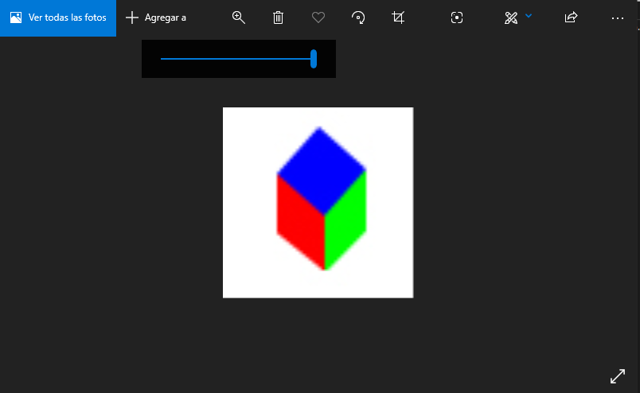
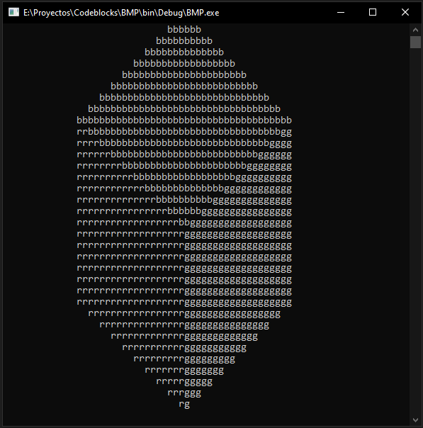

# Lectura de imagen bmp
### Estudiante:

  *Canaza Ccori Franklin
    
### Imagen de Entrada y salida por consola
La imagen es un cubo de 60 x 60 pixeles con los colore principales.

Se muestra como color para cada pixel: "r"=rojo, "b"=azul, "g"=verde, blanco=" "

